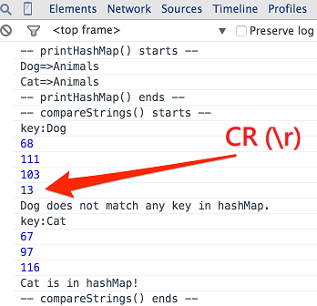

# Javascript strings comparison demo

Sometimes, two strings seem identical when printed out by `printf()`, `System.out.print()`, `console.log()`, etc. But `equals()`, `==` or `===` returns "FALSE" indicating that they are actually different.

In this situation, we should read the API document to make sure we use the API properly.

On the other hand, this may be caused by *whitespaces*, *newline*, or *various symbol* characters in a string. In this case, we should eliminate these characters (i.e. pruning the string) before making a comparison.

在寫程式時，我們常常利用 `printf()`, `System.out.print()`, `console.log()` 等方式將變數印出來看，有時候，我們發現兩個變數（ex:字串）印出來時長得一模一樣，但當利用程式 `equals()`, `==`, `===` 比對時，卻又回傳兩者**不相等**。

此時我們應該要查看文件，重新確認使用之 API 對於**相等**的定義，並確認操作過程正確。

另一個可能的原因是：變數(字串)內含有**空白**、**換行符號**或**印不出來**的字元，這些字元導致字串比對結果不符合預期，在這個情況下，我們應該先“處理乾淨”這些變數，再將之進行比對。

# Demo

Demo page:

- [http://chunnorris.net/demo/javascript-strings-comparison-demo/](http://chunnorris.net/demo/javascript-strings-comparison-demo/)

Sample files:

- [sampleCSV.csv](http://chunnorris.net/demo/javascript-strings-comparison-demo/sampleCSV.csv)

In this example,

1. We load a JSON file and add its elements to a hashmap.
2. We load a CSV file and split each line using `'\n'`, which leaves a `'\r'` character at the end of each line.
3. We compare the elements in **step 2** and **step 3**.
  3a. If we prune the strings from **step 2** using `trim()`, the `'r'` is eliminated and the two strings should be identical.
  3b. Otherwise, the comparison would returns a *'False'* since one of them contains `'\r'` and the other does not.

p.s. The CSV file should be split using `'\r\n'` in step 2 in this case.

在這個範例中，某個 CSV 檔案以 `'\r\n'` 當作換行符號，而我們卻以 `'\n'` 來切割，雖然字串表面看似正常，但被遺留下的 `'\r'` 將會造成我們之後比對字串時出現不符合預期的行為。

# Usage

1. Download or Fork this repository.
2. Run index.html in browser. [1]
3. Load sampleCSV.csv in browser.

[1]
Some browser does not allow you to load local json file due to security reason.
Currently, you can do this with Firefox. But have to do a little configuratoin in Chrome.

下載之後用瀏覽器在本地端端開啟，有些瀏覽器如 Chrome 不允許讀取本地端的 JSON 檔案，可以改用 Firefox 開啟。

# Reference

- [ASCII Codes Table](http://ascii.cl/)
- [StackOverflow: Javascript String Compare == sometimes fails](https://stackoverflow.com/questions/863524/javascript-string-compare-sometimes-fails)
- [How to convert text to binary code in JavaScript?](https://stackoverflow.com/questions/14430633/how-to-convert-text-to-binary-code-in-javascript)

## License

Do whatever you want.